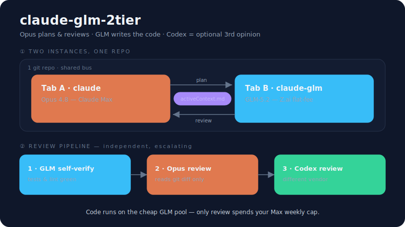

I create this because I get weekly rate limit on Max x20 just after 3 working 5-hour windows.
Disappointed @Anthropic.

# claude-glm-2tier

**Keep coding after your Claude Max weekly cap runs out — without paying per-token.**

A tiny, no-dependency setup that runs two Claude Code instances side by side:

- **Tab A — `claude` (Claude Max / Opus): the brain.** Plans and reviews. The expensive, rare 20%.
- **Tab B — `claude-glm` (Z.ai GLM-5.2, flat-fee Coding Plan): the hands.** Writes code and runs tests. The cheap, bulky 80%.

They share one git repo and a plain handoff file (`.claude/memory/activeContext.md`). Opus reviews
GLM's diff before anything reaches you.

<p align="center"></p>

## Why this works (and why Sonnet subagents don't)

If your bottleneck is the **weekly** cap, switching Opus → Sonnet or using Sonnet subagents doesn't
help: they all draw from the **same Claude pool**. To actually keep going you must move bulk work to
a **different billing pool**. The GLM Coding Plan is a separate flat-fee pool that Claude Code can
drive directly (it exposes an Anthropic-compatible endpoint), so your Max cap only drains on
planning + review.

## Requirements

- [Claude Code](https://claude.com/claude-code) installed (`claude` on your PATH), with a Claude subscription for Tab A.
- A [Z.ai GLM Coding Plan](https://z.ai/subscribe) for Tab B (Lite tier is enough to start). It's flat-fee, not per-token.
- macOS or Linux, `bash`.

## Install

```bash
git clone https://github.com/h3nryprod01/claude-glm-2tier.git
cd claude-glm-2tier
./install.sh
```

Then:

1. Buy a GLM Coding Plan at https://z.ai/subscribe and create an API key.
2. Paste the key (one line) into `~/.claude/.glm-key`.
3. Open a new terminal and check: `claude-glm --version`.

The installer copies into `~/.claude/` (launcher, role card, slash commands, docs) and symlinks
`claude-glm` into `~/.local/bin`. Your `~/.claude/settings.json` is **not** touched.

## Usage

### Two tabs (most reliable)

Best in VS Code: the Claude Code extension panel is Tab A (Opus); an integrated terminal running
`claude-glm` is Tab B (GLM). One window, both models, same workspace.

```
Tab A (claude):     /plan-handoff add input validation to the login form
Tab B (claude-glm): /glm-go
Tab A (claude):     /opus-review
```

### One session (offload without switching)

From an Opus session, offload a chunk to GLM inline:

```
/glm add input validation to the login form
```

Opus shells out to `claude-glm`, then verifies and reviews the result itself. (Note: this nests a
Claude Code process; if it hangs on your machine, use the two-tab flow instead.)

### Background jobs (fire and forget)

Hand a task to GLM as a **background job** and keep working in your Opus session — don't block:

```
/glm-bg refactor the date helpers and add tests
/glm-status          # running / done / failed
/glm-result          # show output, then Opus reviews the diff
/glm-cancel          # stop it
```

Jobs run on the GLM pool in the current repo; state lives in `~/.claude/glm-jobs/<id>/`. This is the
useful half of Codex-plugin's "app-server broker" (background delegation + status/result/cancel) without
a persistent daemon. `glm-job list` shows all jobs.

### Third-opinion review via Codex (optional)

Opus and GLM both live in the Anthropic/Claude-Code world and can share blind spots. For a high-stakes
change you can add a review from a **different vendor** — Codex (GPT) — as a third, independent pass:

```
/codex-review                 # review current changes
/codex-review --base main     # review the branch vs main
/codex-review challenge the retry/caching design   # focused adversarial review
```

This is a **bridge**, not a bundled copy: it shells out to `codex exec review` (read-only). You install
[openai/codex-plugin-cc](https://github.com/openai/codex-plugin-cc) (or `@openai/codex`) separately and
run `codex login` once. It draws your Codex usage and sends the diff to OpenAI — use it for the risky
20%, not every change.

See [`claude/docs/2tier-workflow.md`](claude/docs/2tier-workflow.md) and
[`claude/docs/handoff-prompts.md`](claude/docs/handoff-prompts.md) for the full loop, the review
gate, the `activeContext.md` template, and fail-over rules.

## Slash commands

| Command | Tab | What |
|---|---|---|
| `/plan-handoff <task>` | A (Opus) | Turn a task into a plan in `activeContext.md` |
| `/glm-go` | B (GLM) | Read the plan, execute, self-verify |
| `/opus-review` | A (Opus) | Review GLM's `git diff` before reporting |
| `/glm <task>` | A (Opus) | Offload to GLM inline, then self-verify |
| `/glm-bg <task>` | A (Opus) | Fire a GLM job in the background (non-blocking) |
| `/glm-status [id]` | A (Opus) | Check background GLM jobs |
| `/glm-result [id]` | A (Opus) | Show a finished job's output, then review it |
| `/glm-cancel [id]` | A (Opus) | Cancel a running background job |
| `/codex-review [--base b]` | A (Opus) | Independent 3rd-opinion review via Codex (different vendor) |

## Design notes / gotchas (learned the hard way)

- **Never put GLM env in `~/.claude/settings.json`.** It's global — it would turn *both* tabs into
  GLM. The launcher sets env per-process instead.
- **`--strict-mcp-config` on Tab B.** With many MCP servers, Claude Code's tool schemas can overflow
  GLM's context on startup ("reached its context window limit"). Tab B is the executor and doesn't
  need MCP, so we disable it — smaller context, faster start.
- **The model is pinned to `glm-5.2[1m]`** (the 1M-context variant), with `glm-4.5-air` for the
  haiku tier and `CLAUDE_CODE_AUTO_COMPACT_WINDOW=1000000`. Override with `GLM_MODEL=... claude-glm`.
- **In `/model`, "Opus/Sonnet/Haiku" are just tier *slots*.** Our env remaps them to GLM, so the
  picker may show "Opus" as active while the real model is `glm-5.2[1m]` (shown as "currently
  glm-5.2[1m]" at the top). It's GLM, not Anthropic Opus.
- The GLM Coding Plan covers **text/coding GLM models only** — not image/video models (and Claude
  Code can only drive a text model anyway).

## The Results


This is Z lite plan, so cheap with the same output compare to Opus 4.8 (so f*cking expensive)


## Security

Your GLM key lives in `~/.claude/.glm-key` (mode 600), outside this repo. `.gitignore` blocks
`*.key`. No secret is ever committed.

## License

MIT — see [LICENSE](LICENSE).
